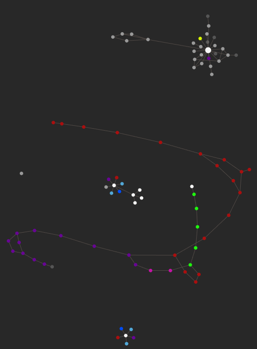
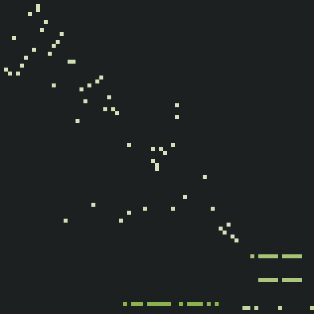
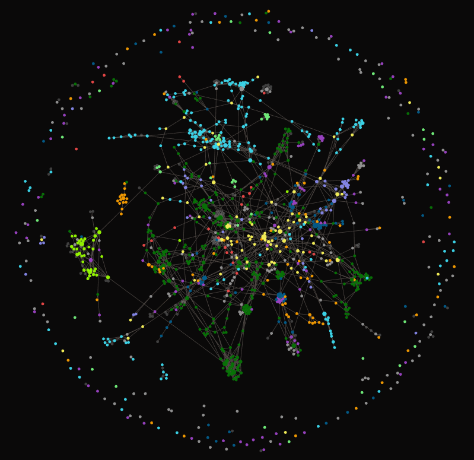

# Adjacency Matrix Maker

An adjacency matrix is a different way to represent Obsidian graph.

It starts with a square grid of cells, where each **row** of cells represents a single note in your vault, and so does each **column**.
If note `i` is linked to note `j`, then the cell in row `i` and column `j` will be coloured in.

## Examples

### Small Vault

This graph conveys the same information as this adjacency matrix:

### Large Vault

And so do these two representations of a vault:

